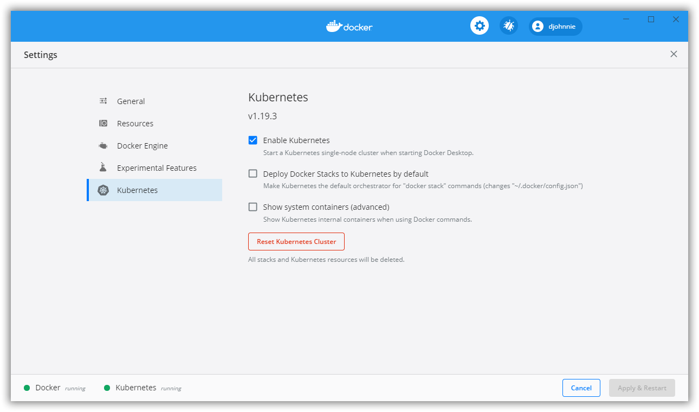

# CloudNativeAndAKS-Allphi-2020

Cloud Native and Azure Kubernetes Service for Allphi.

## Prerequisites

Please prepare your system and install the following software:

- [.NET 5 SDK 5.0.100](https://dotnet.microsoft.com/download/dotnet/5.0)
- [Visual Studio Code](https://code.visualstudio.com/)
- [Docker Desktop](https://www.docker.com/products/docker-desktop)
- [Helm](https://github.com/helm/helm/releases)

Additionally, prepare the following settings and extensions:

### Docker Desktop

Prepare the following settings:

### Visual Studio Code

Install the following extensions:

- [YAML](https://marketplace.visualstudio.com/items?itemName=redhat.vscode-yaml)
- [C#](https://marketplace.visualstudio.com/items?itemName=ms-dotnettools.csharp)
- [dotnet](https://marketplace.visualstudio.com/items?itemName=leo-labs.dotnet)
- [NuGet Package Manager](https://marketplace.visualstudio.com/items?itemName=jmrog.vscode-nuget-package-manager)
- [Azure Account](https://marketplace.visualstudio.com/items?itemName=ms-vscode.azure-account)
- [Azure CLI Tools](https://marketplace.visualstudio.com/items?itemName=ms-vscode.azurecli)
- [Docker](https://marketplace.visualstudio.com/items?itemName=ms-azuretools.vscode-docker)
- [Kubernetes](https://marketplace.visualstudio.com/items?itemName=ms-kubernetes-tools.vscode-kubernetes-tools)
- [Kubernetes Support](https://marketplace.visualstudio.com/items?itemName=ipedrazas.kubernetes-snippets)

## Workshop

This workshop documents the different steps.
Please find them using the following link:
- [Step 01](steps/step-01/README.md) - Connect Visual Studio Code to your Azure Subscription
- [Step 02](steps/step-02/README.md) - Containerize a .NET Core Worker Service
- [Step 03](steps/step-03/README.md) - Create a resource group in your Azure subscription
- [Step 04](steps/step-04/README.md) - Create the AKS (Azure Kubernetes Service) resource in your Azure subscription
- [Step 05](steps/step-05/README.md) - Create the ACR (Azure Container Registry) resource in your Azure subscription
- [Step 06](steps/step-06/README.md) - Deploy the Worker Service inside the Kubernetes cluster
- [Step 07](steps/step-07/README.md) - Create an ASP.NET Core WebApi and deploy it to Kubernetes
- [Step 08](steps/step-08/README.md) - Expose the ASP.NET Core WebApi as a network service
- [Step 09](steps/step-09/README.md) - Make changes to the .NET Core Worker Service and make it call the WebApi to fetch the machine name
- [Step 10](steps/step-10/README.md) - Create an ASP.NET Core MVC Web application and deploy it to Kubernetes
- [Step 11](steps/step-11/README.md) - Create a public IP-address and domain name
- [Step 12](steps/step-12/README.md) - Add an NGINX ingress controller
- [Step 13](steps/step-13/README.md) - Have some fun with the Web application and deployments of the WebApi

## Code

This workshops uses the existing [CSharpWars](https://github.com/Djohnnie/CSharpWars) code as an example to deploy cloud-native applications.