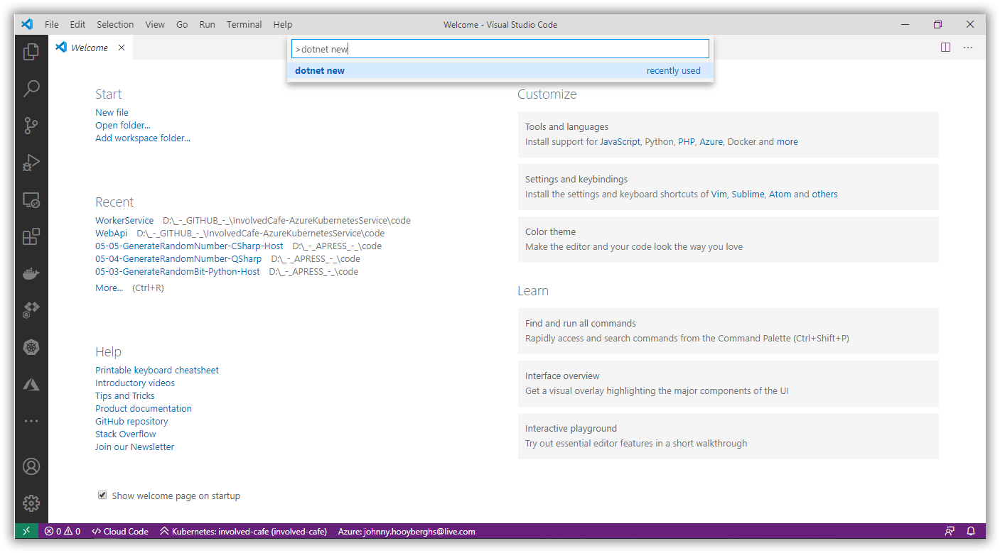
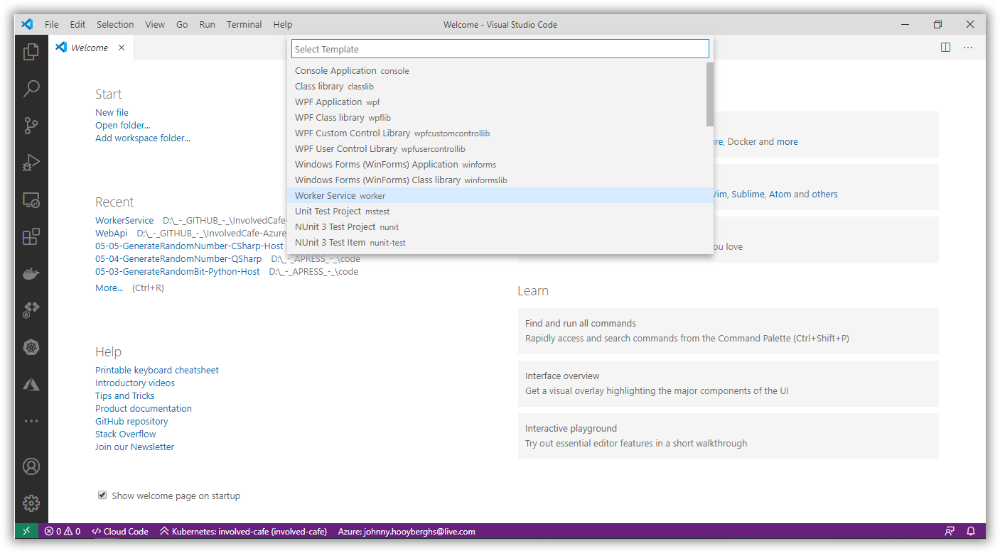
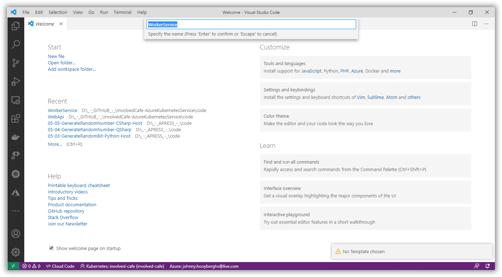
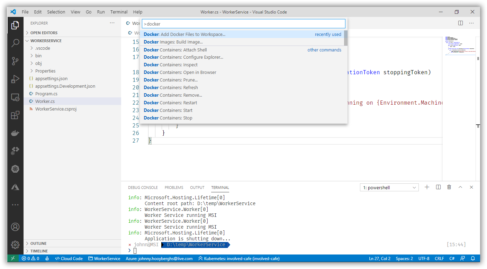
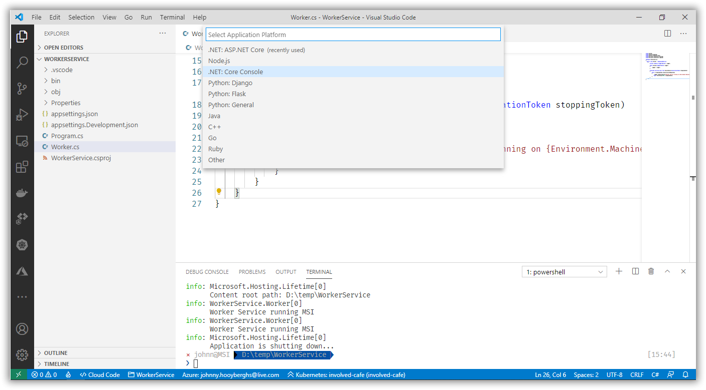
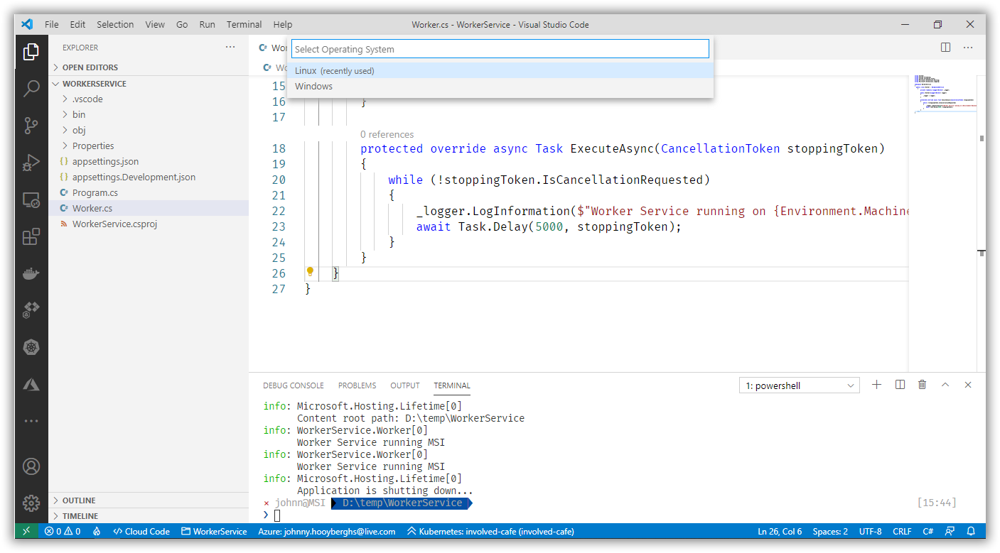
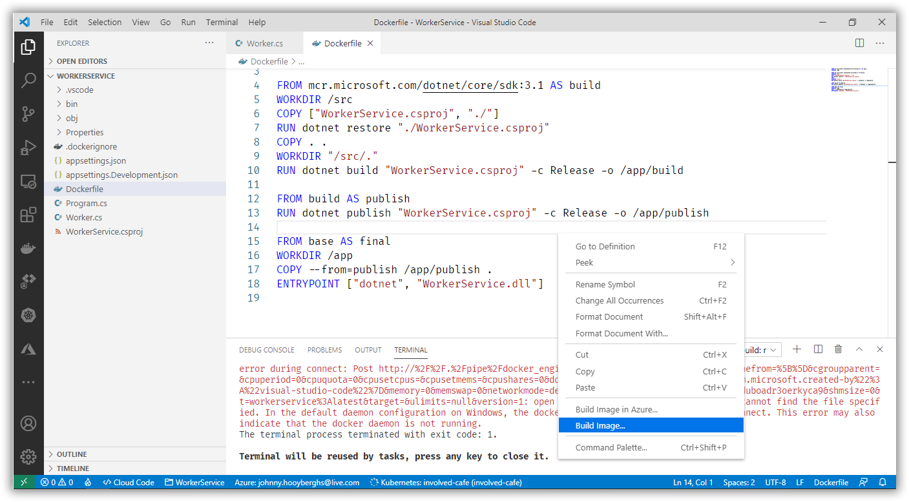
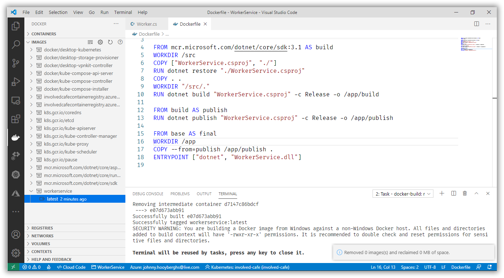
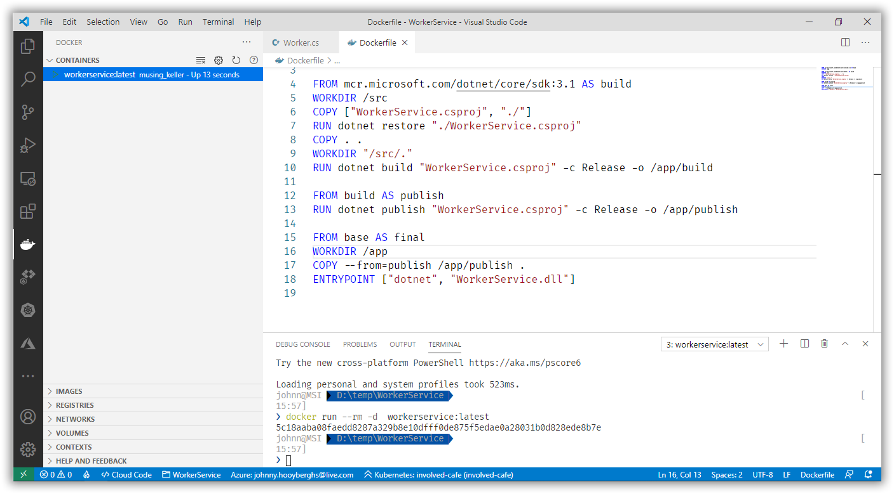
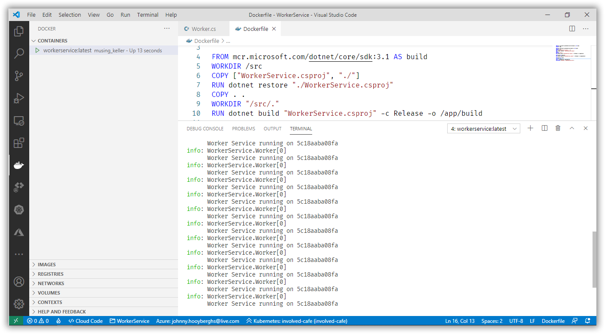

# Involved Café 2020-07: AKS Workshop

[Previous step](../step-01/README.md) - [Next step](../step-03/README.md)

## Step 2 - Containerize a .NET Core Worker Service

Use the Command Palette inside Visual Studio Code to create a new .NET Core application:



Select the Worker Service template:



Create a folder and specify that name as the project name:

```
WorkerService
```



Open the project folder in Visual Studio Code and open a terminal pane.
Type the following command to run your created Worker Service:

```
dotnet run
```

Now open the Worker.cs file and make a small change to the existing code:

```csharp
protected override async Task ExecuteAsync(CancellationToken stoppingToken)
{
    while (!stoppingToken.IsCancellationRequested)
    {
        _logger.LogInformation($"Worker Service running on {Environment.MachineName}");
        await Task.Delay(5000, stoppingToken);
    }
}
```

Run the Worker Service again from the console and see the result. Every five seconds, it should print your machine name to the terminal.

In order to create a Docker container from this code, open the Command Palette in Visual Studio Code and find the command to create a docker file:



Select the .NET Core Console application platform for Linux and don't include the optional Docker Compose files:






The generated docker file is a script you can use to build a docker image. Right-click the file contents and select Build Image...



Your local Docker instance should now have the Docker image available. You can verify this by using the Docker icon on the left hand side of Visual Studio Code and looking at the list of images:



You can test the image by running it as a container. Right-click the latest-tag and select Run. You can find running containers in the list of containers:



Right click the running container and choose View Logs. Your active terminal window should show the Console output from your WorkerService:



Finally, go ahead and stop the running container to free up some system resources.

[Previous step](../step-01/README.md) - [Next step](../step-03/README.md)