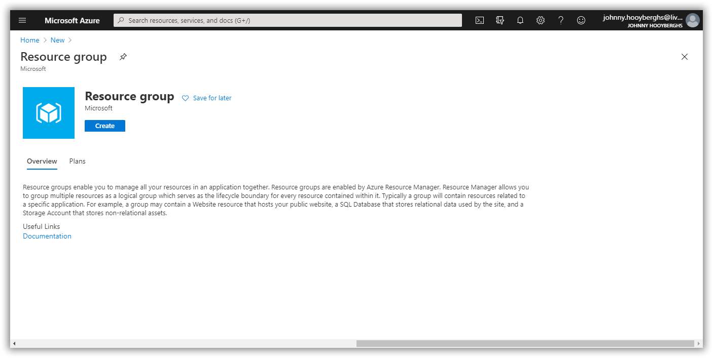
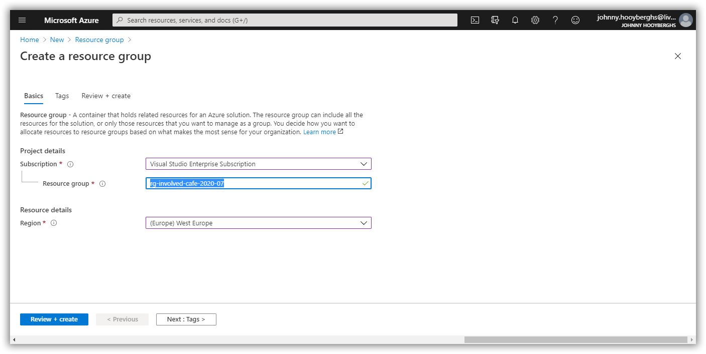

# Involved Café 2020-07: AKS Workshop

[Previous step](../step-02/README.md) - [Next step](../step-04/README.md)

## Step 3 - Create a resource group in your Azure subscription

Open the Azure Portal, login with your Azure subscription account and create a new resource group:



Create the resource group inside your selected subscription and West-Europe region:

```
rg-involved-cafe-2020-07
```



[Previous step](../step-02/README.md) - [Next step](../step-04/README.md)