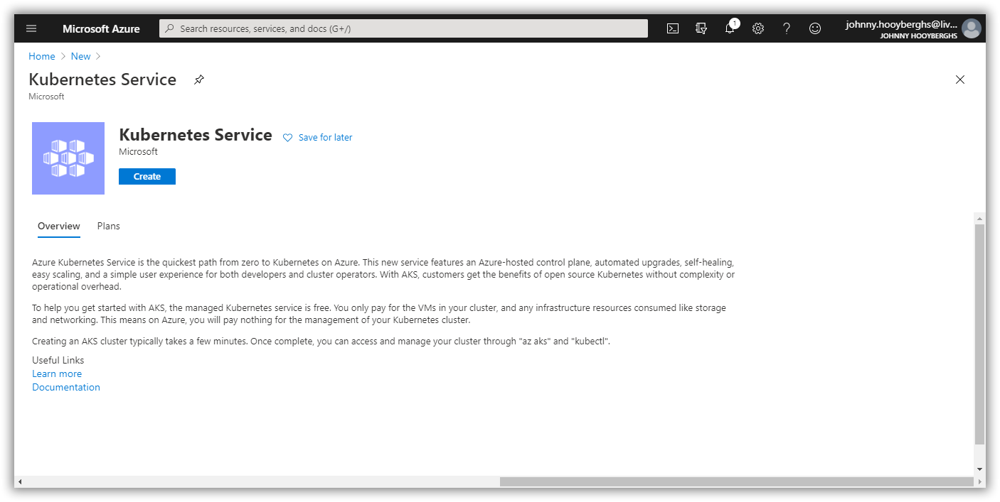
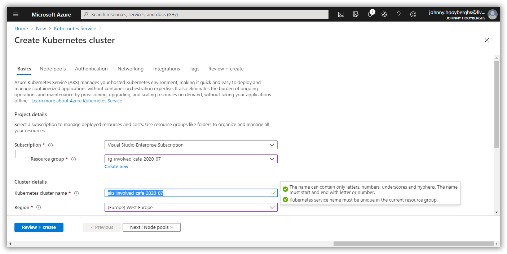
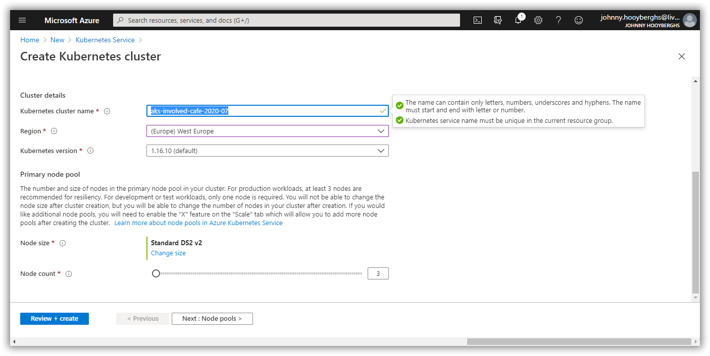

# Involved Café 2020-07: AKS Workshop

[Previous step](../step-03/README.md) - [Next step](../step-05/README.md)

## Step 4 - Create the AKS (Azure Kubernetes Service) resource in your Azure subscription

Use the Azure portal to create a new Azure Kubernetes Service:



Define the Kubernetes cluster name, region, version and node size:

```
aks-involved-cafe-2020-07
```





You don't need any additional changes to the proposed settings so you can finish the wizard and create the cluster.

[Previous step](../step-03/README.md) - [Next step](../step-05/README.md)