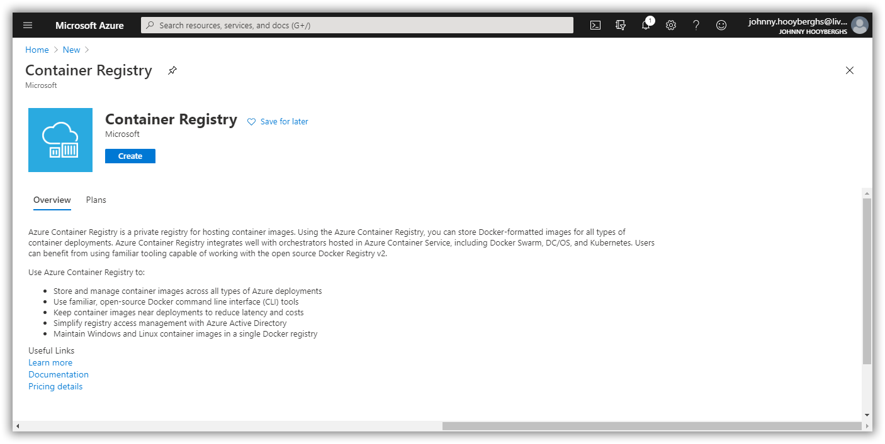
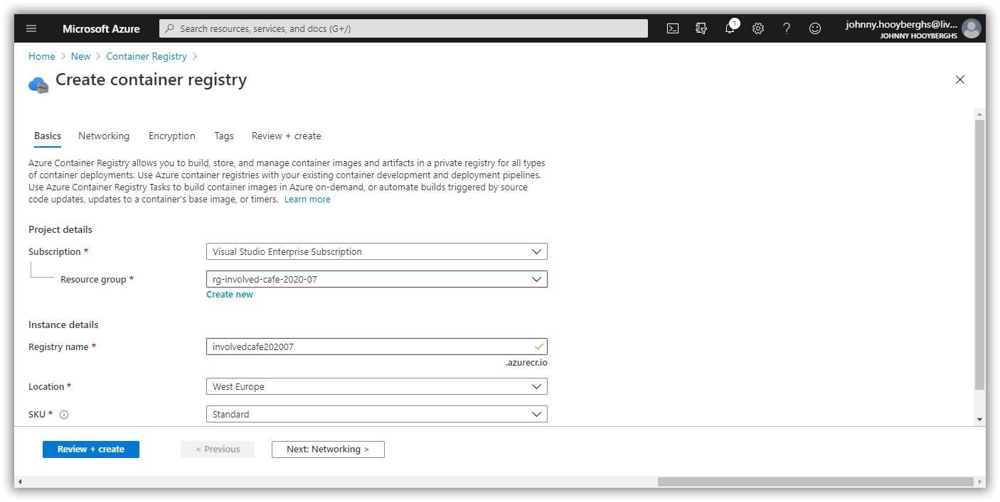
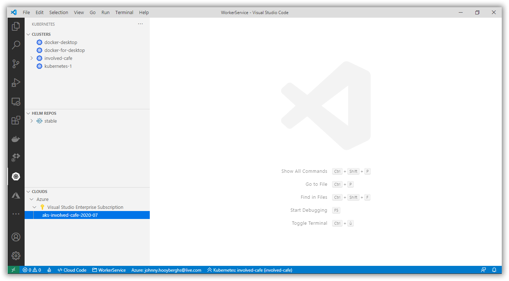
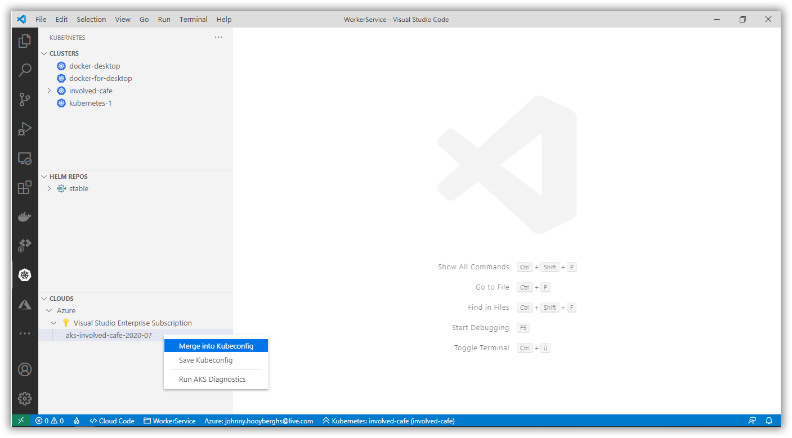
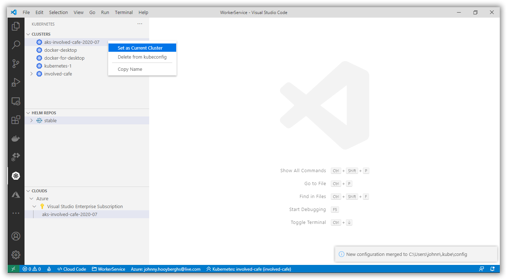

# Involved Café 2020-07: AKS Workshop

[Previous step](../step-04/README.md) - [Next step](../step-06/README.md)

## Step 5 - Create the ACR (Azure Container Registry) resource in your Azure subscription

Use the Azure portal to create a new Azure Container Registry:



Define the container registry name and region:

```
involvedcafe202007
```



You don't need any additional changes to the proposed settings so you can finish the wizard and create the container registry.

You are going to use the container registry to push Docker images to and consume them from Azure Kubernetes Service. Therefor, the Kubernetes cluster needs access (a trust relationship) with the container registry.

Execute the following command from the Visual Studio Code terminal:

```
az aks update -g <resource-group> -n <aks-name> --attach-acr <acr-name>
```

```
az aks update -g rg-involved-cafe-2020-07 -n aks-involved-cafe-2020-07 --attach-acr involvedcafe202007
```

Inside Visual Studio Code, open Kubernetes in the Activity Bar and select your Kubernetes cluster from the Azure Cloud pane:



Right click your Kubernetes cluster and merge it into your local Kubeconfig:



Find your Kubernetes cluster in the Clusters pane and set it as the current cluster:



[Previous step](../step-04/README.md) - [Next step](../step-06/README.md)