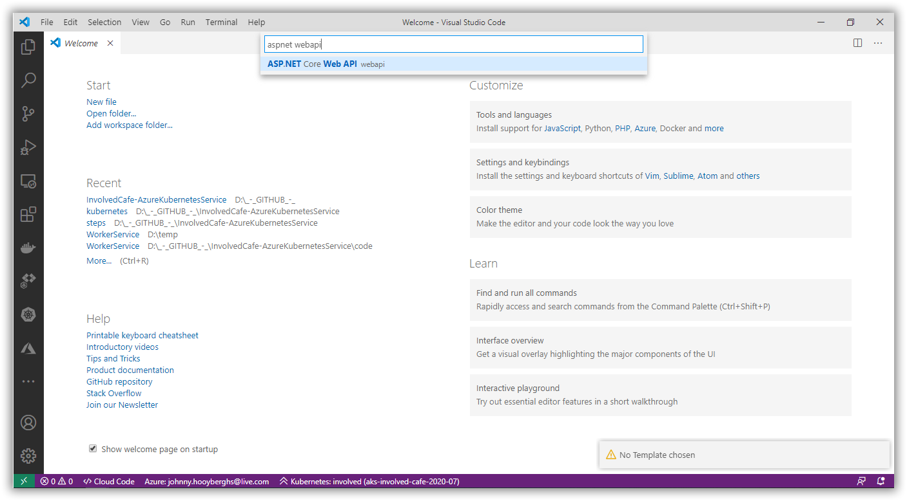
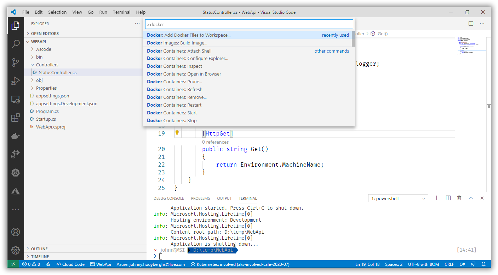
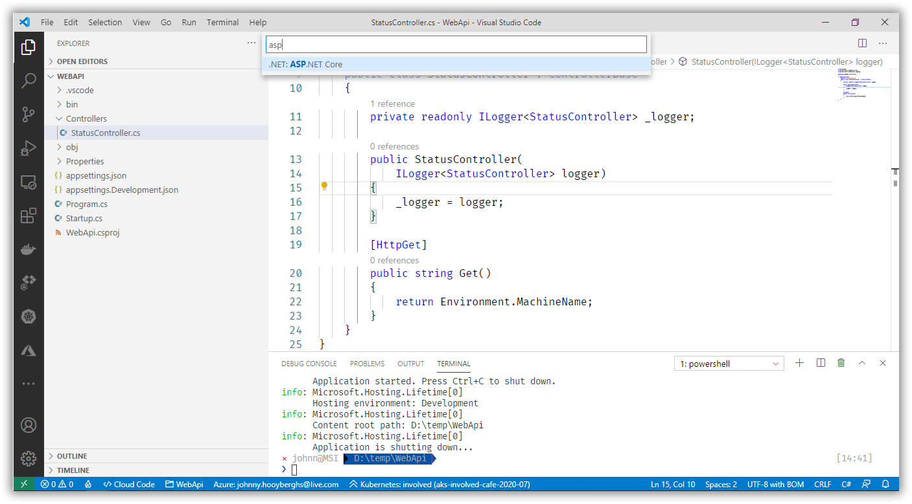
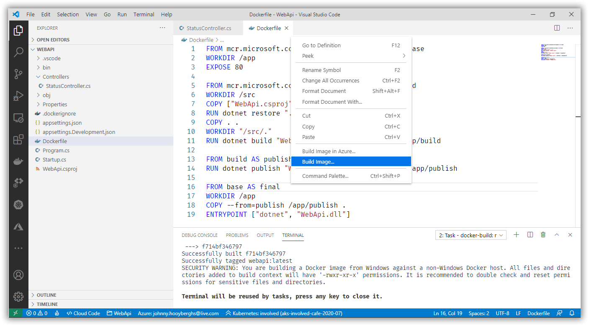
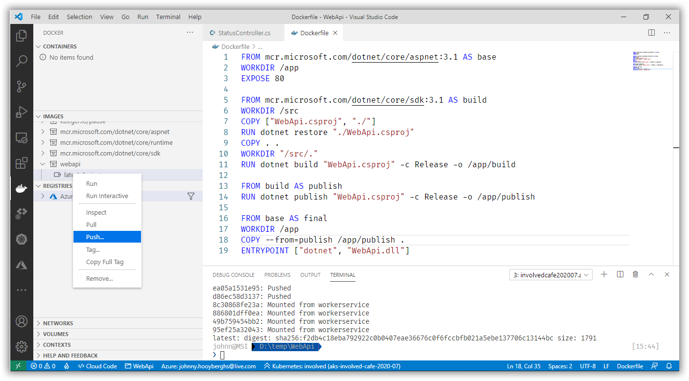
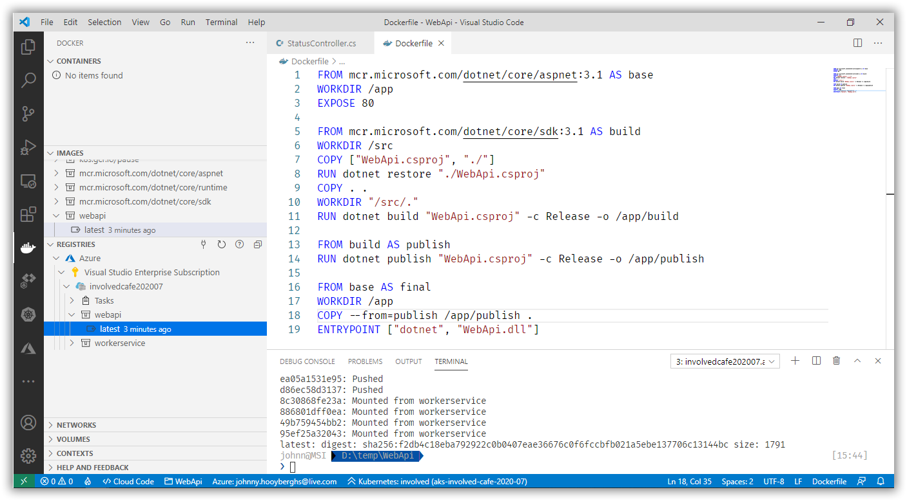
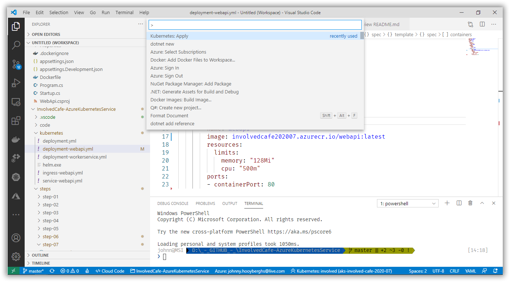
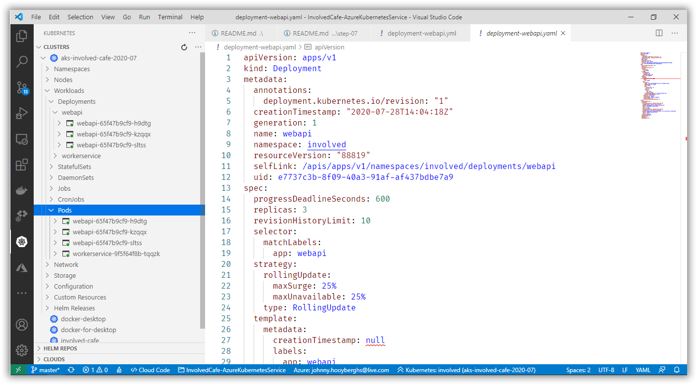

# Involved Café 2020-07: AKS Workshop

[Previous step](../step-06/README.md) - [Next step](../step-08/README.md)

## Step 7 - Expose the ASP.NET Core WebApi as a network service

Use the Command Palette inside Visual Studio Code to create a new ASP.NET Core WebApi application:

```
dotnet new
```

```
ASP.NET Core Web API
```



Rename the WeatherForecastController to StatusController and update it to only have a GET action that returns the current machine name:

```csharp
namespace WebApi.Controllers
{
    [ApiController]
    [Route("[controller]")]
    public class StatusController : ControllerBase
    {
        private readonly ILogger<StatusController> _logger;

        public StatusController(
            ILogger<StatusController> logger)
        {
            _logger = logger;
        }

        [HttpGet]
        public string Get()
        {
            return Environment.MachineName;
        }
    }
}
```

Kust like in [step 02](../step-02/README.md), you can add a dockerfile by using the Visual Studio Code command palette, but this time, choose the ASP.NET Core application platform for Linux without optional Docker Compose files:





Right click the dockerfile and build it:



From the Docker Activity pane in Visual Studio Code, push the image you just built to your Azure Container Registry:





Again, similar to [step 06](../step-06/README.md), create a Kubernetes deployment that will deploy your WebApi container. This time, choose **3** replicas, so three Pods will be up-and-running at all time:

```yaml
apiVersion: apps/v1
kind: Deployment
metadata:
  name: webapi
spec:
  replicas: 3
  selector:
    matchLabels:
      app: webapi
  template:
    metadata:
      labels:
        app: webapi
    spec:
      containers:
      - name: webapi
        image: involvedcafe202007.azurecr.io/webapi:latest
        resources:
          limits:
            memory: "128Mi"
            cpu: "500m"
        ports:
        - containerPort: 80
```

Apply the deployment script by using the Visual Studio Code command palette:



Inside the Kubernetes Activity Bar, you should be able to find your running Pods:



[Previous step](../step-06/README.md) - [Next step](../step-08/README.md)