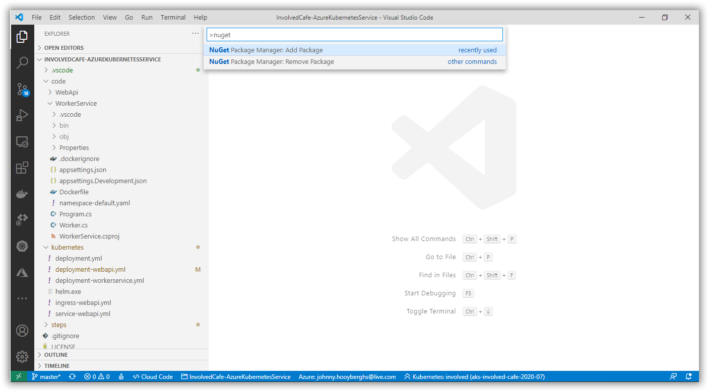
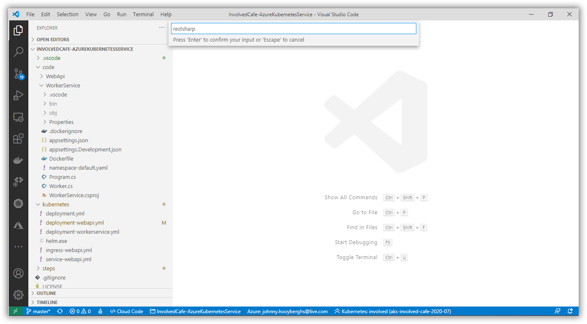
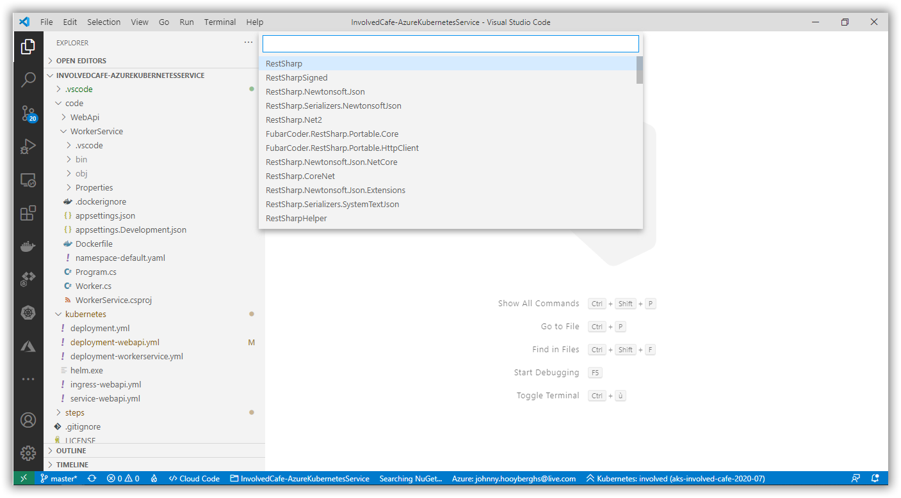
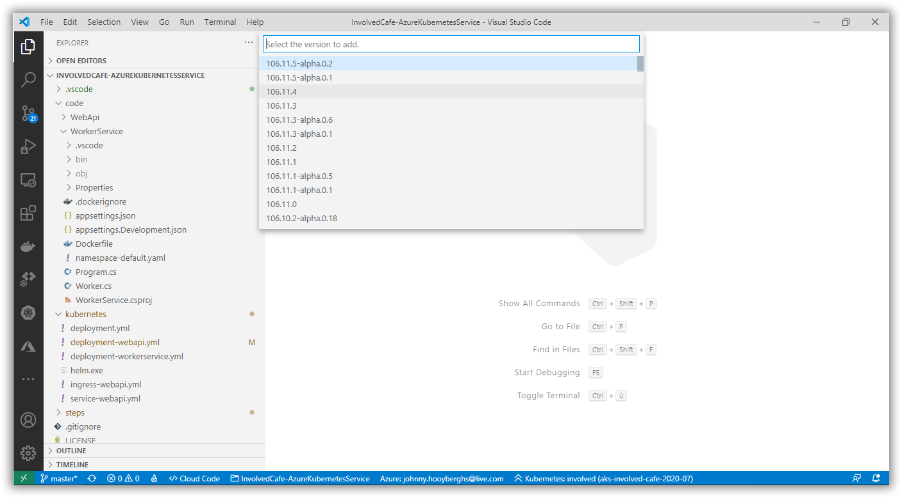
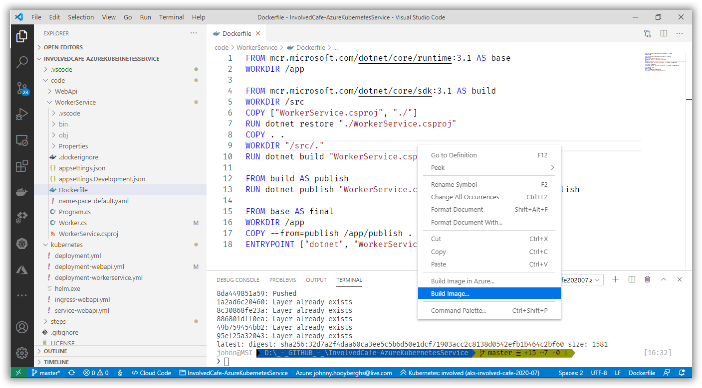
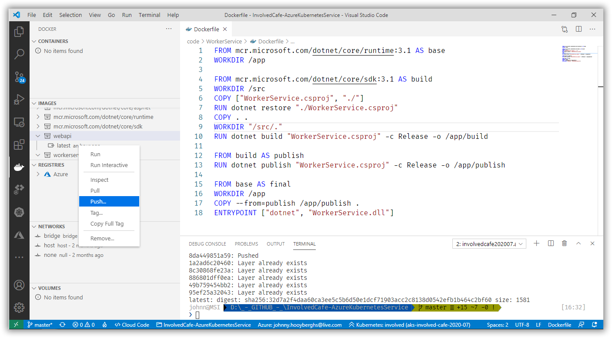
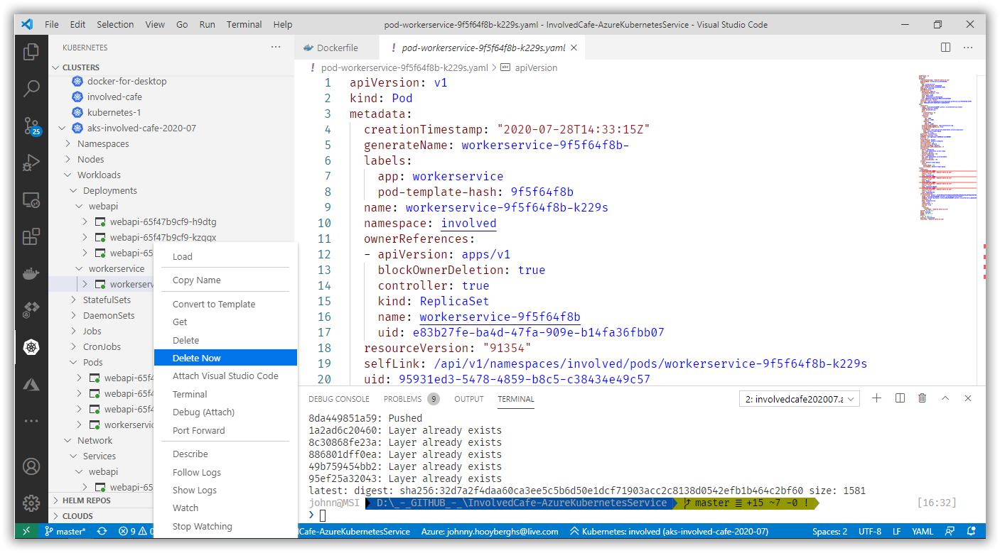
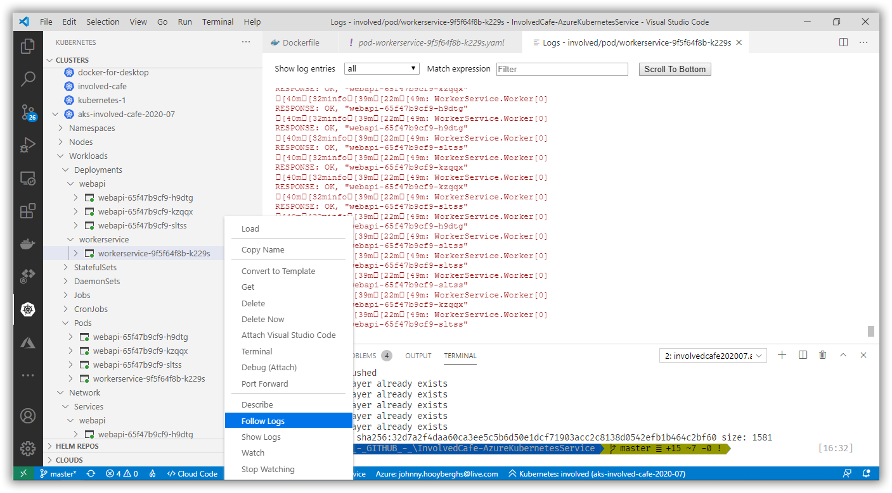

# Involved Café 2020-07: AKS Workshop

[Previous step](../step-08/README.md) - [Next step](../step-10/README.md)

## Step 9 - Make changes to the .NET Core Worker Service and make it call the WebApi to fetch the machine name

Open the WorkerService project in Visual Studio Code and add the RestSharp NuGet package using the command palette:









Make the following changes to the Worker class. This will now fetch a machine name from the webapi. Thanks to the Kubernetes service, the WebApi will be accessible from within the cluster using its app-name as domain name:

```csharp
namespace WorkerService
{
    public class Worker : BackgroundService
    {
        private readonly ILogger<Worker> _logger;
        private readonly RestClient _client = new RestClient("http://webapi");

        public Worker(ILogger<Worker> logger)
        {
            _logger = logger;
        }

        protected override async Task ExecuteAsync(CancellationToken stoppingToken)
        {
            while (!stoppingToken.IsCancellationRequested)
            {
                var request = new RestRequest("status", Method.GET);
                var response = await _client.ExecuteAsync(request);
                _logger.LogInformation($"RESPONSE: {response.StatusCode}, {response.Content}");
                
                await Task.Delay(500, stoppingToken);
            }
        }
    }
}
```

Open the dockerfile for the WorkerService project and build it using the right-click method:



If the image is built successfully, find it in your local Docker images and push it to your Azure Container Registry.



In the Visual Studio Code Activity pane for Kubernetes, find your WorkerService pod and delete it. Because of the deployment you created earlier, Kubernetes will spin up a new instance of that Pod because you specified to always have one replica running. Each new instance will be fetched from the Azure Container Registry so it will spin up a new version.



Finally, follow the logs for the WorkerService and notice that the returned machine names from the WebApi are different for some calls. This is because the Kubernetes service for WebApi will automatically load balance the requests between the running pods, configured using the replica parameter:



[Previous step](../step-08/README.md) - [Next step](../step-10/README.md)