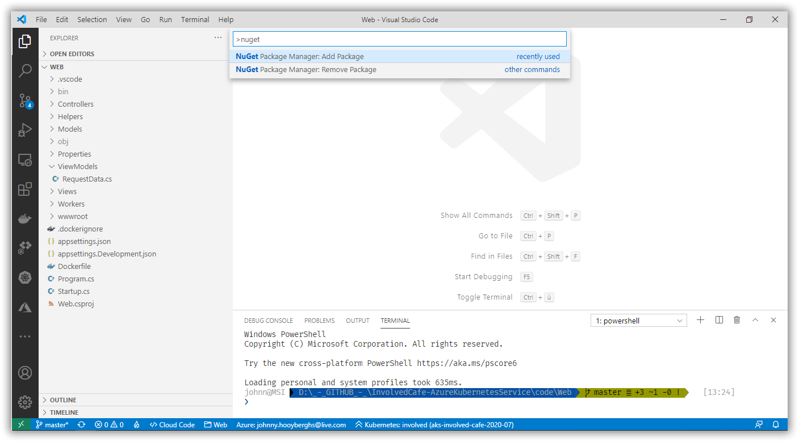

# Involved Café 2020-07: AKS Workshop

[Previous step](../step-09/README.md) - [Next step](../step-11/README.md)

## Step 10 - Create an ASP.NET Core MVC Web application and deploy it to Kubernetes

Create a new ASP.NET Core MVC web application using the command palette in Visual Studio Code:


The web application should call into the loadbalanced WebApi and display the responses from that in a web page. Because of this, add a folder ViewModels and inside that folder a C# source file containing the following class:

```csharp
using System.Collections.Generic;

namespace Web.ViewModels
{
    public class RequestData
    {
        public RequestData()
        {
            Entries = new List<RequestEntry>();    
        }

        public int TotalRequests { get; set; }
        public List<RequestEntry> Entries { get; set; }
    }

    public class RequestEntry
    {
        public string MachineName { get; set; }
        public int Occurences { get; set; }
        public decimal Percentage { get; set; }
    }
}
```


Because you need to request the data from the WebApi, add the RestSharp NuGet package to the project using the command palette in Visual Studio Code:



Now add a folder called **Helpers** and add a C# source file with the following class:

```csharp
using System.Collections.Generic;
using Web.ViewModels;

namespace Web.Helpers
{
    public class RequestHelper
    {
        private readonly Dictionary<string,int> _responses = new Dictionary<string, int>();

        public void Register( string machineName )
        {
            if(!_responses.ContainsKey(machineName))
            {
                _responses.Add(machineName, 0);
            }

            _responses[machineName]++;
        }

        public RequestData GetData()
        {
            var data = new RequestData();

            foreach( var key in _responses.Keys )
            {
                data.TotalRequests += _responses[key];
            }

            foreach( var key in _responses.Keys )
            {
                data.Entries.Add( new RequestEntry
                {
                    MachineName = key,
                    Occurences = _responses[key],
                    Percentage = (decimal)_responses[key] / (decimal)data.TotalRequests * 100.0M
                });
            }

            return data;
        }
    }
}
```

This class will keep all responses from the WebApi in memory and will transform them into a dataset that can be viewed on a webpage.


To create a background process that calls the WebApi many times, you will introduce a Worker Service inside your ASP.NET Core MVC project. For this to work, add a folder called **Workers** and inside, create a C# source file containing the following class:

```csharp
using System;
using System.Threading;
using System.Threading.Tasks;
using Microsoft.Extensions.Hosting;
using Microsoft.Extensions.Logging;
using RestSharp;
using Web.Helpers;

namespace Web.Workers
{
    public class RequestWorker : BackgroundService
    {
        private readonly RequestHelper _requestHelper;
        private readonly ILogger<RequestWorker> _logger;
        private readonly RestClient _client = new RestClient("http://webapi");

        public RequestWorker(
            RequestHelper requestHelper, 
            ILogger<RequestWorker> logger)
        {
            _requestHelper = requestHelper;
            _logger = logger;
        }

        protected override async Task ExecuteAsync(CancellationToken stoppingToken)
        {
            while (!stoppingToken.IsCancellationRequested)
            {
                try
                {
                    var request = new RestRequest("status", Method.GET);
                    var response = await _client.ExecuteAsync(request);
                    if( response.IsSuccessful )
                    {
                        _requestHelper.Register(response.Content);
                    }
                    
                    await Task.Delay(100, stoppingToken);
                }
                catch(Exception ex)
                {
                    _logger.LogError(ex, ex.Message);
                }
            }
        }
    }
}
```

This background worker will run every 100 milliseconds and fetch a response from the WebApi.


To connect all the dots, you should configure these classes in the dependency injection container in the Startup class:

```csharp
public void ConfigureServices(IServiceCollection services)
{
    services.AddControllersWithViews();
    services.AddSingleton<RequestHelper>();
    services.AddHostedService<RequestWorker>();
}
```

Finally, change the HomeController to only have a Get method and call into the RequestHelper:

```csharp
using Microsoft.AspNetCore.Mvc;
using Microsoft.Extensions.Logging;
using Web.Helpers;

namespace Web.Controllers
{
    public class HomeController : Controller
    {
        private readonly RequestHelper _requestHelper;
        private readonly ILogger<HomeController> _logger;

        public HomeController(
          RequestHelper requestHelper,
          ILogger<HomeController> logger)
        {
            _requestHelper = requestHelper;
            _logger = logger;
        }

        public IActionResult Index()
        {
            var data = _requestHelper.GetData();
            return View(data);
        }

        public IActionResult RequestData()
        {
            var data = _requestHelper.GetData();
            return PartialView("_RequestData", data);
        }
    }
}
```

And make the following changes to the views in order to display the data:

**~/Views/Home/Index.cshtml**

```html
@model Web.ViewModels.RequestData

@{
    ViewData["Title"] = "Home Page";
}

<div class="text-center">
    <h1 class="display-4">Welcome</h1>
    
    <br>
    <br>
    <br>

    <div id="request-data">
      @Html.Partial("_RequestData", Model )
    </div>   

</div>

@section Scripts {
    <script type="text/javascript">
      
      $(document).ready(function () 
      {
        setInterval(function()
        { 
          $('#request-data').load('/Home/RequestData');
        }, 500);        
      });

    </script>
}
```

**~/Views/Home/_RequestData_.cshtml**

```html
@model Web.ViewModels.RequestData

<table class="table">
  <thead>
    <tr>
      <th scope="col">Machine name</th>
      <th scope="col">Number of responses</th>
      <th scope="col">Hit percentage</th>
    </tr>
  </thead>
  <tbody>
    
    @foreach (var entry in Model.Entries)
    {
      <tr>
        <td>@entry.MachineName</td>
        <td>@entry.Occurences</td>
        <td>@String.Format("{0:N2}", entry.Percentage) %</td>
      </tr>      
    }

  </tbody>
</table>
```


Now, use the command palette to generate a dockerfile using the ASP.NET Core application platform for Linux:


Build the dockerfile and push the image to your Azure Container Registry:


Create two new deployment YAML file to deploy the Web application. One for the deployment, and one for the service that exposes the web application to the internal Kubernetes HTTP network. Apply these YAML scripts using the command palette:

**deployment-web.yml**

```yaml
apiVersion: apps/v1
kind: Deployment
metadata:
  name: web
spec:
  replicas: 1
  selector:
    matchLabels:
      app: web
  template:
    metadata:
      labels:
        app: web
    spec:
      containers:
      - name: webapi
        image: involvedcafe202007.azurecr.io/web:latest
        resources:
          limits:
            memory: "128Mi"
            cpu: "500m"
        ports:
        - containerPort: 80
```

**service-web.yml**

```yaml
apiVersion: v1
kind: Service
metadata:
  name: web
spec:
  selector:
    app: web
  ports:
  - port: 80
    targetPort: 80
```

If you look at the Kubernetes cluster, you should have a web deployment with 1 pod running, a webapi deployment with 3 pods running and a workerservice deployment with 1 pod running:


[Previous step](../step-09/README.md) - [Next step](../step-11/README.md)