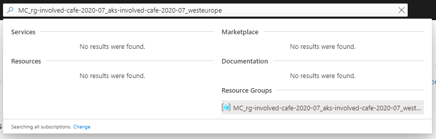
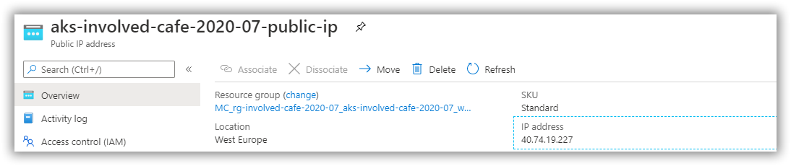

# Involved Café 2020-07: AKS Workshop

[Previous step](../step-10/README.md) - [Next step](../step-12/README.md)

## Step 11 - Create a public IP-address and domain name

The web application is exposed inside the Kubernetes cluster, but not accessible from the outside world. For this to work, we will need to add some things to Kubernetes and Azure.

Azure has created a seperate resource group for all Kubernetes networking components. Use the following command to learn the name of this resource group:

```
az aks show --resource-group <your resource group> --name <your aks cluster> --query nodeResourceGroup -o tsv
```

```
az aks show --resource-group rg-involved-cafe-2020-07 --name aks-involved-cafe-2020-07 --query nodeResourceGroup -o tsv
```

For my case, it outputs the following resource group:

```
MC_rg-involved-cafe-2020-07_aks-involved-cafe-2020-07_westeurope
```

You can find the resource group and its resources inside the Azure Portal using the search feature:



Now that you know the resource group for networking components, connected to your Kubernetes cluster, you can go ahead and use the following command to create a public IP resource:

```
az network public-ip create --resource-group <your kubernetes networking resource group> --name <public-ip resource name> --sku Standard --allocation-method static --query publicIp.ipAddress -o tsv
```

```
az network public-ip create --resource-group MC_rg-involved-cafe-2020-07_aks-involved-cafe-2020-07_westeurope --name aks-involved-cafe-2020-07-public-ip --sku Standard --allocation-method static --query publicIp.ipAddress -o tsv
```

If you look at the Azure Portal, you should be able to find the public-ip resource and see the actual assigned IP-address:



Using the next scripts, you update the ip-address resource with a DNS name:

```
az resource show --query id --resource-type Microsoft.Network/publicIPAddresses -n <public-ip resource name> -g <your kubernetes networking resource group>
```

```
az resource show --query id --resource-type Microsoft.Network/publicIPAddresses -n aks-involved-cafe-2020-07-public-ip -g MC_rg-involved-cafe-2020-07_aks-involved-cafe-2020-07_westeurope
```

For the next script, copy the response from the previous script:

```
az network public-ip update --ids "<copied-response>" --dns-name <dns-name>
```

```
az network public-ip update --ids "/subscriptions/5db7e9b4-a01f-4bd4-b7e8-26ca1d5b3ad3/resourceGroups/MC_rg-involved-cafe-2020-07_aks-involved-cafe-2020-07_westeurope/providers/Microsoft.Network/publicIPAddresses/aks-involved-cafe-2020-07-public-ip" --dns-name involved-cafe-2020-07
```


----------------


helm install nginx-ingress stable/nginx-ingress --namespace ingress  --set controller.replicaCount=2 --set controller.nodeSelector."beta\.kubernetes\.io/os"=linux --set defaultBackend.nodeSelector."beta\.kubernetes\.io/os"=linux --set controller.service.loadBalancerIP="40.74.19.227"